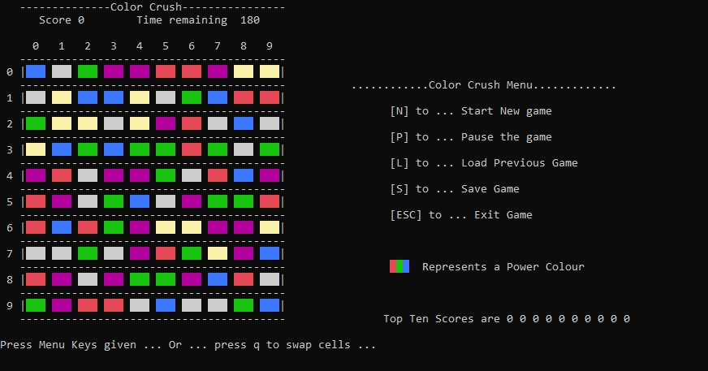

# Candy_Crush
 A C++ Implementation of Candy Crush (Windows)

This a full-fledge Candy Crush Game in C++.
Its has the functionaity to save,Pause and Load.

**How to Play**

The Menu can see from the above picture 
  Press  **N** to Start a New Game
  Press  **P** to Pause the Game
  Press  **L** to Load Previous Game
  Press  **S** to save Current Game
  Press  **ESE** to Exit the Game

The When Saving the games a text file is created in the same directory as the executable containing the info current state of game.

 Each row and Col is numbered, first the block to swaped is selected then the block to be swaped with is selected. 

 The block/candy is selected by specifing the row and col number.

 When the timer runs out you get your max score